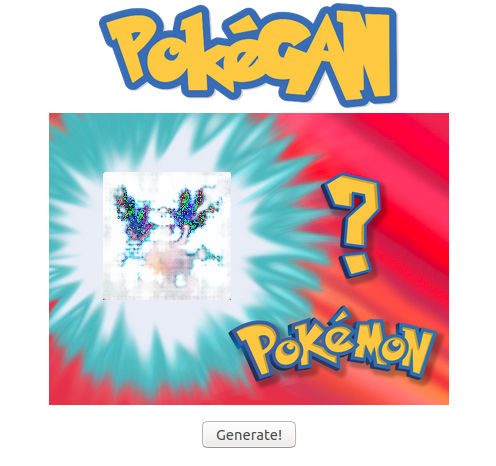

    

## Pok&eacute;GAN: Gotta Generate 'em All!
I trained a Wasserstein GAN with gradient penalty (WGAN-GP) to generate images of Pok&eacute;mon.  The Jupyter notebook in this repository goes through the entire process of from obtaining the data using a webscraper, to training the WGAN-GP, to deploying the generator with a Flask web app.  The web app itself is also checked into the repository.

 
Training the GAN required about 24 hours on a laptop with an Intel Core i7-6820HQ CPU @ 2.70GHz and an NVIDIA Quadro M2002M GPU (CUDA Compute Capability 5.0).

I wrote the code in Python 3.8 and used Fast.ai v2 to install most of the dependencies needed to run the notebook.  A **requirements.txt** file is included for convenience.  

The files of interest are:

 * **PokeGAN.ipynb** The code to develop the webscraper, image pre-processing, and WGAN-GP architecture and training loop.
 * **app.py** Runs the Flask web server app that generates random Pok&eacute;mon images.

For results and discussion, refer to *PokeGAN.ipynb.*

## The Pok&eacute;GAN Webapp
You can try out the generator yourself!  Install Flask, navigate to the "webapp" directory, open a console and type `flask run`.  Navigate to 127.0.0.1:5000 in your browser and generate some Pok&eacute;mon!

## Acknowledgments

### Image Credits                
Thanks to [Font Meme](https://fontmeme.com/) for the Pok&eacute;GAN image generated using their [Pok&eacute;mon font](https://fontmeme.com/pokemon-font/).  Web app background image created by [DesenhosdoReu](http://desenhosdoreu.deviantart.com/art/Whos-That-Pokemon-582871089).  Training images scraped from the [Pok&eacute;mon Fandom wiki](https://pokemon.fandom.com/wiki/Pok%C3%A9mon_Wiki).

### Conceptual Resources
Thanks to Christian Versloot for his explanations of [transpose convolution](https://www.machinecurve.com/index.php/2019/09/29/understanding-transposed-convolutions/) and [leaky ReLU](https://www.machinecurve.com/index.php/2019/10/15/leaky-relu-improving-traditional-relu/#does-leaky-relu-really-work).  Thanks also to Mayank Agarwal for his [informative illustration](https://becominghuman.ai/all-about-normalization-6ea79e70894b) of normalization techniques.  Finally, thanks to Francesco for his tutorial on [how-and-when to use](https://github.com/datorresb/Pytorch-how-and-when-to-use-Module-Sequential-ModuleList-and-ModuleDict/blob/master/README.md) the various PyTorch containers.

### Programming Resources
Thanks of course to Nathan Inkawhich, the author of the PyTorch [DCGAN tutorial](https://pytorch.org/tutorials/beginner/dcgan_faces_tutorial.html).  While designing the WGAN-GP I referred to code written by [Mathworks](https://www.mathworks.com/help///deeplearning/ug/trainwasserstein-gan-with-gradient-penalty-wgan-gp.html), [Emilien Dupont](https://github.com/EmilienDupont/wgan-gp/), [Erik Lindernoren](https://github.com/eriklindernoren/PyTorch-GAN/), [Martin Arjovsky](https://github.com/martinarjovsky/WassersteinGAN/), and [Aladdin Persson](https://github.com/aladdinpersson/Machine-Learning-Collection/).   

## References
1. I. J. Goodfellow et al., “Generative Adversarial Networks,” arXiv:1406.2661 [cs, stat], Jun. 2014, Accessed: Jun. 09, 2021. [Online]. Available: http://arxiv.org/abs/1406.2661
2. A. Radford, L. Metz, and S. Chintala, “Unsupervised Representation Learning with Deep Convolutional Generative Adversarial Networks,” arXiv:1511.06434 [cs], Jan. 2016, Accessed: Jun. 09, 2021. [Online]. Available: http://arxiv.org/abs/1511.06434
3. M. Arjovsky, S. Chintala, and L. Bottou, “Wasserstein GAN,” arXiv:1701.07875 [cs, stat], Dec. 2017, Accessed: Jun. 08, 2021. [Online]. Available: http://arxiv.org/abs/1701.07875
4. I. Gulrajani, F. Ahmed, M. Arjovsky, V. Dumoulin, and A. Courville, “Improved Training of Wasserstein GANs,” arXiv:1704.00028 [cs, stat], Dec. 2017, Accessed: Jun. 09, 2021. [Online]. Available: http://arxiv.org/abs/1704.00028

